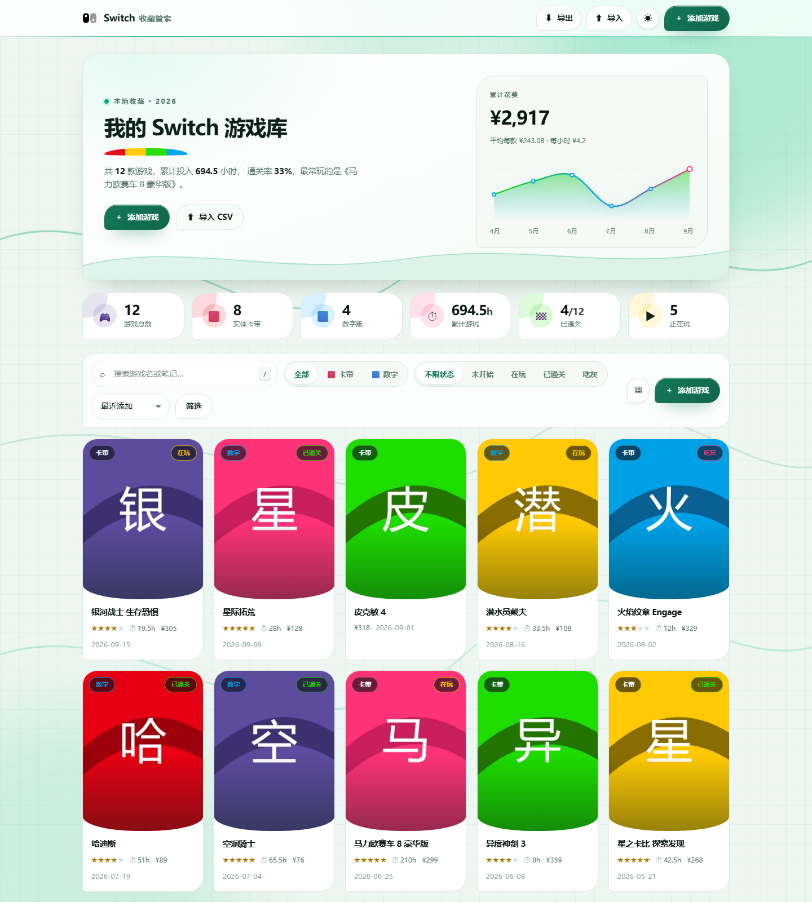
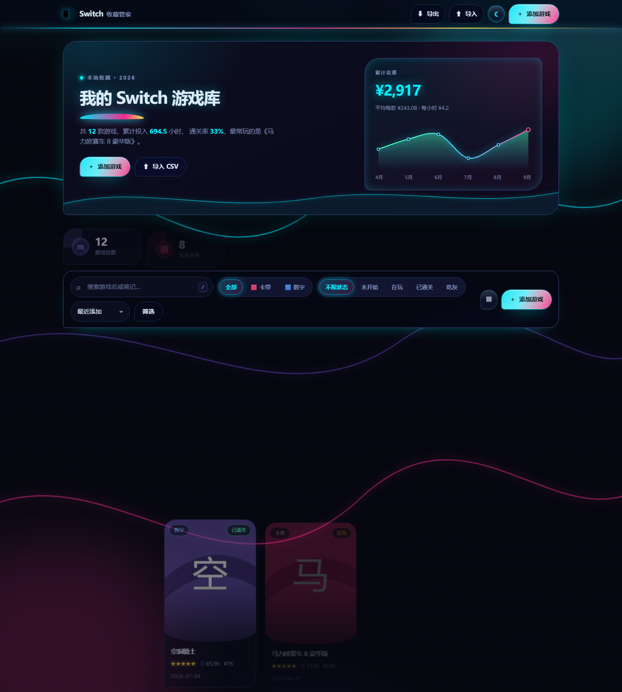
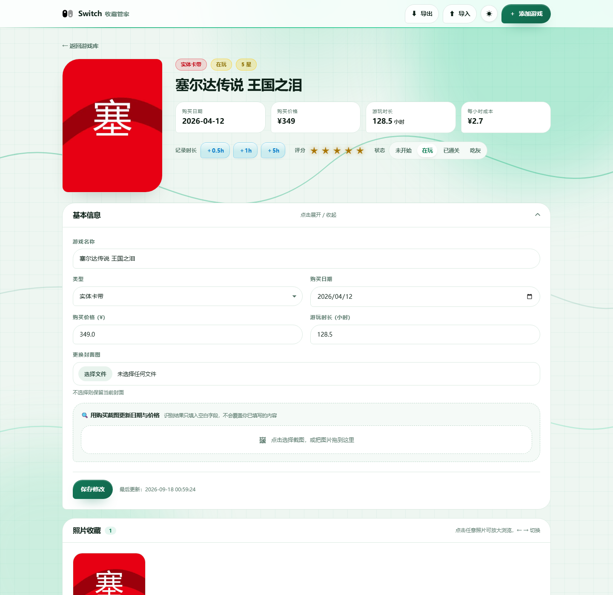
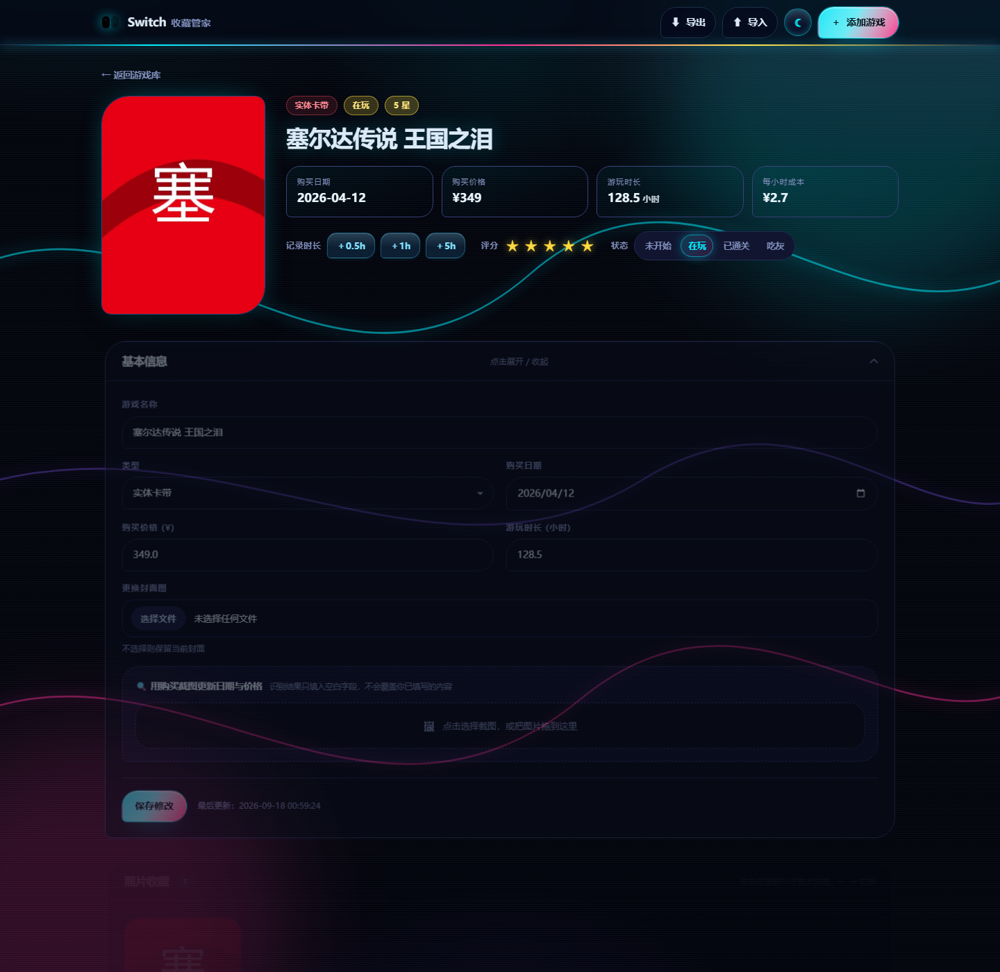

# Switch 游戏收藏管家 🎮

[](LICENSE)
[](https://www.python.org/)
[](#下载)
[](#数据与安全说明)

本地运行的 Switch 游戏收藏管理工具：记录卡带与数字版、统计花费与游玩时长、
用购买截图 OCR 自动填写日期与金额，并为每款游戏保存照片与心流笔记。

> **数据全部保存在本机** `data/app.db`，程序不联网、不抓取账号、不上传任何信息。
> 唯一的可选联网功能是「任天堂账号同步」，默认关闭，需要你主动绑定。

## 截图

| 明亮模式 | 黑夜模式 |
|---|---|
|  |  |
|  |  |

## 下载

到 [Releases](https://github.com/kd0zero/switch-game-manager/releases) 下载最新的 `SwitchGameManager-*-win64.zip`，
解压后双击 `SwitchGameManager.exe` 即可，**无需安装 Python**。

体积约 200MB：里面含 OpenCV、ONNX Runtime 和三个离线 OCR 模型，
这是「离线识别截图」必须付出的体积代价（打包时已裁掉约 37MB 用不到的部分）。

也可以自行从源码打包，见下方「重新打包桌面版」。

---

## 两种用法

| 方式 | 适合 | 入口 |
|---|---|---|
| **桌面版（免安装）** | 日常使用，双击就能跑 | `SwitchGameManager.exe` |
| **源码版** | 改代码、二次开发 | `python app.py` |

桌面版首次运行会在 exe 同目录生成 `data\`（数据库）与 `static\`（图片），
整个文件夹可以直接复制备份。详见该目录内的《使用说明.txt》。

---

## 源码版运行

```bash
pip install -r requirements.txt
python app.py
```

浏览器打开 <http://127.0.0.1:5000>

Windows 上若已存在 `.venv`，可直接：

```powershell
.\.venv\Scripts\python.exe app.py
```

---

## 重新打包桌面版

修改源码后，用下面任意一种方式重新生成 `SwitchGameManager\`：

```powershell
# 方式一：Python 脚本（推荐）
.\.venv\Scripts\python.exe build_exe.py

# 方式二：输出到别处，不影响已发布的目录
.\.venv\Scripts\python.exe build_exe.py --out D:\build
```

打包前请先关闭正在运行的 `SwitchGameManager.exe`，否则目录被占用会删除失败。
需要额外安装的只有一个打包工具：`pip install pyinstaller`。

脚本会自动完成：生成 onedir 绿色目录 → 裁剪无用的大文件（视频编解码、
AVIF 插件，约省 37MB）→ 写入《使用说明.txt》与《备份数据.bat》。

---

## 功能

### 收藏管理
- 游戏名称、类型（实体卡带 / 数字版）、状态（未开始 / 在玩 / 已通关 / 吃灰）
- 购买日期、购买价格、游玩时长、五星评分、封面图
- 搜索（同时匹配名称与笔记）、按类型 / 状态筛选、8 种排序、分页浏览
- 网格 / 列表两种视图，选择会记住

### 数据看板
- 游戏总数、卡带数、数字版数、累计游玩时长、已通关 / 在玩数量
- 累计花费、平均每款单价、每小时成本、近六个月购买花费柱状图

### 购买截图 OCR（离线）
- 上传 eShop / 订单截图，自动识别**购买日期**与**实付金额**并回填表单
- 只填充空白字段，不会覆盖你已经手填的内容
- 多候选打分：识别出多个金额时给出候选列表，可一键改选
- 完全离线（RapidOCR + ONNX），首次使用会自动在后台加载模型

### 照片与笔记
- 每款游戏可上传多张照片（支持拖拽、多选），自动生成 WebP 缩略图加速浏览
- 点击照片进入灯箱，`←` `→` 切换、`Esc` 关闭
- 心流笔记自动保存（停止输入约 1 秒后写入），带字数统计与未保存提醒

### 游玩时长同步
两条来源，共用同一套「识别 → 人工确认 → 批量写入」流程，**都不会自动改库**：

**① 截图识别（推荐，零风险）**
- 上传 Switch 个人主页「游玩记录」或家长控制 App 月报的截图
- 自动识别「游戏名 + 时长」，支持这些写法：
  `125 小时以上` / `123小时` / `12 小时 30 分钟` / `45 分钟` /
  `123時間以上` / `123 hours or more` / `123 hrs` / `未满 1 小时`
- 标题在时长上一行也能正确配对（Switch 的排版就是标题在上、时长在下）
- 识别结果按标题相似度匹配库内游戏，未匹配的可用下拉手动指定
- 每行可选择「覆盖」或「累加」，确认后才写库


### 备份
- 一键导出 CSV（UTF-8 BOM，Excel 直接打开不乱码）
- 支持把导出的 CSV 重新导入，重名自动跳过
- 桌面版还附带《备份数据.bat》，一键打包 `data\` 与上传的图片

### 界面：双主题 · 任天堂配色 · 贝塞尔曲线语言
右上角 ☀ / ☾ 一键切换，默认跟随系统偏好，选择会被记住，切换时全站颜色交叉淡入。

| | 明亮模式「白绿科技」 | 黑夜模式「赛博朋克」 |
|---|---|---|
| 底色 | 白 / 浅绿，叠加 34px 技术细网格 | 深空蓝紫，霓虹辉光 + CRT 扫描线 |
| 主色 | 翠绿 `#00a86b` | 霓虹青 `#00f0ff` + 品红 `#ff2e97` + 亮黄 |
| 点缀 | **任天堂经典六色**（见下） | 同一组配色的霓虹化变体 |
| 质感 | 纤细描边、等宽数字、克制留白 | 辉光描边、霓虹渐变、色散投影 |
| 按钮 | 磨砂玻璃 + 深绿实心（6.1:1） | 磨砂玻璃 + 青→品红渐变（13.4:1） |

**任天堂经典配色**（明亮模式用 vivid 版本做填充/描边，`*-ink` 版本做文字以保证对比度）：

| 色 | 取值 | 用在哪 |
|---|---|---|
| 任天堂红 | `#e60012` | 品牌标志、实体卡带、卡带卡片悬停光晕、标题弧线 |
| 霓虹蓝 | `#00a0e9` | 数字版、数字卡片悬停光晕、折线图中段 |
| 霓虹黄 | `#ffc800` | 评分徽章、正在玩状态、卡带卡片点缀 |
| 霓虹绿 | `#1edc00` | 已通关状态、折线图起点 |
| 霓虹粉 | `#ff3278` | 吃灰状态、累计游玩、折线图终点 |
| 靛蓝 | `#5c4b9e` | 游戏总数、主按钮悬停光晕 |

六张数据卡片各配一种色，卡带卡片悬停发红光、数字版发蓝光——呼应 Joy-Con 的红蓝双色。

**磨砂玻璃按钮**：
- `backdrop-filter: blur(18px) saturate(180%)` + 半透明底色 + 内高光 + 柔和外阴影
- 主按钮为半透明渐变玻璃（94% 不透明度），叠加高光后白字仍达 6.1:1
- 不支持 `backdrop-filter` 的环境自动降级为不透明背景

**丝滑过渡**：
- 主题切换：临时挂 480ms 过渡类，全站背景/描边/文字/填充交叉淡入，不生硬跳变
- 数据卡片数字从 0 缓动滚到目标值（三次方缓出），并带 500ms 兜底保证最终值正确
- 卡片/面板滚动进入视口时按 45ms 错峰上浮，动画结束后移除类以免压住悬停位移
- 按钮/卡片的悬停位移统一使用回弹曲线，按压时快速回弹
- 全部动效在 `prefers-reduced-motion` 下自动关闭

**曲线语言**（全站几何尽量由贝塞尔构成）：
- 背景三条 SVG 三次贝塞尔曲线 + 两个有机 blob 光斑（缓慢漂移形变）
- Hero 底部贝塞尔波浪、标题下四色弧形下划线
- 「近六个月花费」由 Catmull-Rom 样条实时换算三次贝塞尔路径绘制，描边为绿→蓝→粉渐变
- 卡片 / 面板 / 弹窗统一使用非对称有机圆角（如 `26px 26px 26px 8px`、
  `46% 54% 58% 42% / 48% 42% 58% 52%`），避免呆板的等圆角
- 全部动效走 5 个 `cubic-bezier()` 缓动令牌（出场 / 进退 / 回弹 / 柔和 / 弧线）
- 指针柔光：跟随光标的径向渐变（仅精确指针设备启用）

**其他**：
- 键盘快捷键：`/` 聚焦搜索、`Ctrl/Cmd + S` 立即保存笔记、`Esc` 关闭弹窗
- 响应式布局，手机 / 平板可用；支持 `prefers-reduced-motion`
- 配色经脚本审计：两个主题共 **40 项对比度全部满足 WCAG AA**（≥4.5:1），
  审计脚本见 `tests/audit_theme.py`

---


### 安全与隐私

- `session_token` 等同于账号凭据，保存在本机 `data/nintendo.json`，
  **不会上传到任何第三方**；随时可点「解除绑定」删除
- 令牌换取的是短期 `id_token`（约 15 分钟自动续期）
- 手机端官方 App 与这里的绑定互不冲突，可同时存在

### 技术细节（对照开源实现核实）

| 项目 | 值 |
|---|---|
| 鉴权 | 任天堂账号 PKCE（`session_token_code` → `session_token` → `id_token`） |
| 客户端 ID | `54789befb391a838`（家长控制 App） |
| 接口根 | `https://app.lp1.znma.srv.nintendo.net` |
| 数据接口 | `playSummary/fetchDailySummaries`、`fetchMonthlySummary` |
| 标题映射 | `parentalControlSetting/fetchParentalControlSetting` 的白名单 |

---

## 目录结构

```
sw/
├── app.py                  # Flask 主程序：路由、校验、统计、缩略图、导入导出
├── ocr_engine.py           # OCR 封装：图片预处理 + 日期 / 金额候选打分提取
├── desktop.py              # 桌面版启动器（打包入口：选端口、开浏览器、防重复启动）
├── build_exe.py            # 一键打包脚本（生成下面的 SwitchGameManager/）
├── icon.ico                # 应用图标
├── requirements.txt
├── README.md
│
├── SwitchGameManager/      # ★ 打包好的桌面软件（免安装绿色版）
│   ├── SwitchGameManager.exe
│   ├── _internal/          # 依赖库与前端资源，勿删
│   ├── data/               # 首次运行自动生成：数据库与会话密钥
│   ├── static/             # 首次运行自动生成：上传的图片与缩略图
│   ├── 使用说明.txt
│   └── 备份数据.bat
│
├── templates/              # 页面模板
│   ├── base.html           # 顶栏、提示气泡、确认弹窗、灯箱
│   ├── index.html          # 看板 + 筛选 + 游戏网格 + 添加 / 导入弹窗
│   ├── game_detail.html    # 详情、快捷记录、照片墙、笔记
│   └── error.html          # 400 / 404 / 413 / 500 友好页面
│
├── static/                 # 源码版的前端资源与上传目录
│   ├── style.css
│   ├── app.js
│   ├── uploads/            # 上传的封面与照片（原图）
│   └── thumbs/             # 自动生成的 WebP 缩略图缓存
│
└── data/
    ├── app.db              # SQLite 数据库（首次运行自动创建）
    └── secret.key          # 会话密钥（本地自动生成）
```

> 源码版与桌面版的数据目录是各自独立的：源码版用 `sw\data\`，
> 桌面版用 `SwitchGameManager\data\`。想把收藏搬到桌面版，
> 在源码版里「导出 CSV」，再在桌面版里「导入 CSV」即可。

---

## 数据与安全说明

- 数据库结构变更通过增量迁移完成，**旧版 `data/app.db` 可直接沿用**，
  启动时会自动补上 `status` / `rating` / `updated_at` 三列。
- 上传做了扩展名白名单、8MB 单张体积限制与 Pillow 真实解码校验，
  改后缀的假图片会被拒绝。
- 所有写操作带 CSRF 校验；删除文件前会校验路径，防止目录穿越。
- 缩略图按需生成并缓存在 `static/thumbs/`，删除原图时会一并清理。
- 打包脚本只把 `style.css` 与 `app.js` 打进软件，**不会把你的照片打进安装包**。

## 常见问题

**OCR 识别不准？**
截图请尽量包含「购买日期」「实付 / 合计」等字样，并保持文字清晰。
识别结果下方会列出所有日期与金额候选，可直接点击改选。

**没装 OCR 依赖能用吗？**
可以。程序会自动降级为纯手动录入，其余功能完全不受影响。

**桌面版为什么有 200MB？**
里面含 OpenCV、ONNX Runtime 与三个 OCR 模型（约 200MB），
这是离线识别必须付出的体积代价；打包时已经裁掉了约 37MB 用不到的部分。

**桌面版放在 Program Files 里可以吗？**
不建议。程序把数据写在 exe 同级目录，该位置通常不可写；
若确实不可写，程序会自动把数据退回到 `%USERPROFILE%\SwitchGameManager`。
最稳妥的做法是放在 D 盘或桌面的普通文件夹里。

**怎么备份最稳妥？**
复制整个 `SwitchGameManager\` 目录即可；也可用里面的《备份数据.bat》。

---

## 项目结构

```
sw/
├── app.py                  # Flask 主程序：路由、校验、统计、缩略图、导入导出
├── ocr_engine.py           # OCR 封装：图片预处理 + 日期 / 金额候选打分提取
├── playtime.py             # 游玩时长同步：截图识别解析 + 游戏名模糊匹配
├── nintendo_parental.py    # 任天堂家长控制 API 客户端（可选功能）
├── desktop.py              # 桌面版启动器（打包入口）
├── build_exe.py            # 一键打包脚本
├── icon.ico
├── requirements.txt
├── templates/              # 页面模板
├── static/                 # 前端资源（style.css / app.js）
├── docs/screenshots/       # README 用的截图
└── .github/workflows/      # 打 tag 自动打包 EXE 并发布 Release
```

> `SwitchGameManager/`（打包产物）、`data/`（你的数据库）、`static/uploads/`
> 都已在 `.gitignore` 中排除，不会进仓库。

---

## 参与贡献

欢迎提 Issue 和 PR。提交前建议先跑一遍自带的两套测试：

```powershell
# 功能回归（148 项）
.\.venv\Scripts\python.exe tests\test_smoke.py

# 游玩时长同步（93 项）
.\.venv\Scripts\python.exe tests\test_playtime.py

# 主题配色与对比度审计（63 项）
.\.venv\Scripts\python.exe tests\audit_theme.py static\style.css
```

## 免责声明

- 本项目为个人使用的本地工具，与任天堂株式会社无任何关联。
- 「任天堂账号同步」使用的是非官方接口，可能随时失效；
  请自行评估风险，并遵守任天堂的用户协议。
- OCR 识别结果可能有误，写入前请人工确认。

## 许可证

[MIT](LICENSE) © 2026 kd0zero

游戏名称、封面与相关素材版权归各自权利人所有。
